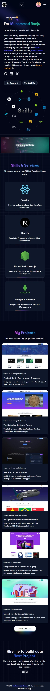
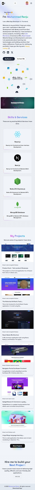

## Md Ranju App

This is a simple app that displays the website of Md Ranju.

## Features

- Displays the website of Md Ranju
- Dark and light mode support
- No internet connection detection

## Getting Started

### Prerequisites

- Node.js >= 16
- Expo CLI

### Installation

1. Clone the repository
2. Navigate to the project directory
3. Run `npm install` to install the required dependencies
4. Run `expo start` to start the development server
5. Open the app in your browser

## Contributing

Contributions are welcome! If you find any issues or have suggestions for improvements, please open an issue or submit a pull request on the GitHub repository.

## License

This project is licensed under the MIT License. See the [LICENSE](LICENSE) file for more information.

